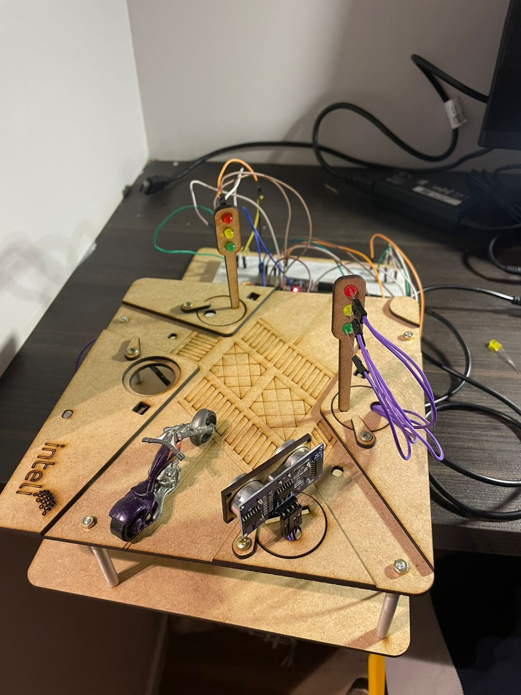

# Semáforo Inteligente com ESP32 - GRUPO 2

## Objetivo

Desenvolver um sistema de semáforo inteligente que:

- Funcione em modo normal com alternância entre verde, amarelo e vermelho.
- Ative alerta visual quando um objeto é detectado próximo (sensor ultrassônico).
- Entre em modo noturno com pisca amarelo quando a luminosidade ambiente estiver baixa.
- Permita controle remoto via Ubidots (ligar/desligar sistema).
- Envie dados de luminosidade (LDR) para monitoramento remoto.

## Fotos da construção do protótipo

## link do vídeo de funcionamento 
https://youtube.com/shorts/KOQPLC6UCcs?si=yp198-c1N_eYS5GT

## Link da interface
https://inteli-ubidots.iot-application.com/app/dashboards/public/dashboard/ZEpf9fhguvvVloX77q80IcCwXU5eN4fkf9ZE2BhYvgs?navbar=true&contextbar=false&layersBar=false

## Materiais Utilizados

| Componente                       | Quantidade | Função                                      |
|----------------------------------|------------|---------------------------------------------|
| ESP32 DevKit                     | 1          | Microcontrolador principal                  |
| Sensor LDR                       | 1          | Detecta luminosidade ambiente               |
| Sensor Ultrassônico HC-SR04      | 1          | Detecta objetos próximos                    |
| LEDs (vermelho, amarelo, verde)  | 6          | Simulam os semáforos                        |
| Resistores (220Ω)                | 6          | Limitam corrente para os LEDs               |
| Jumpers                          | Vários     | Conexões entre componentes e ESP32          |
| Protoboard                       | 1          | Montagem dos circuitos                      |

---

## Funcionalidades do Sistema

### 1. Modo Normal

- Alternância entre semáforo 1 e semáforo 2.
- Ciclo:
  - Verde por 6 segundos
  - Amarelo por 2 segundos
  - Troca de semáforo ativo

### 2. Modo Sensor Ultrassônico

- Se um objeto for detectado entre 2 cm e 8 cm:
  - Ambos os semáforos piscam todos os LEDs por 1 segundo.
  - Após esse tempo, o sistema retorna ao modo anterior.

### 3. Modo Noturno

- Ativado automaticamente quando a luminosidade (LDR) estiver abaixo de 800.
- Desativado quando a luminosidade ultrapassa 900 (histerese).
- Ambos os semáforos piscam apenas o LED amarelo.

### 4. Controle Remoto via Ubidots

- Botão virtual para ativar/desativar o sistema (`sistema_ativo`).
- Envio contínuo do valor do LDR para a variável `ldr_luminosidade`.

---

## Lógica de Prioridade no `loop()`

1. **Sistema desligado** → apaga todos os LEDs.  
2. **Sensor ultrassônico ativo** → pisca todos os LEDs por 1 segundo.  
3. **Modo noturno ativo** → pisca amarelo nos dois semáforos.  
4. **Modo normal** → alterna entre semáforo 1 e 2 com verde/amarelo/vermelho.  

---

## Integração com Ubidots

- Protocolo: **MQTT**
- Broker: `industrial.api.ubidots.com`
- Variáveis utilizadas:
  - `ldr_luminosidade` → valor do LDR  
  - `sistema_ativo` → controle remoto do sistema  

---

## Testes e Validação

- Testar o ciclo normal com alternância entre semáforos.
- Aproximar um objeto do sensor ultrassônico e verificar o alerta.
- Cobrir o LDR para simular baixa luminosidade e ativar modo noturno.
- Usar botões no Ubidots para ativar/desativar o sistema.
- Verificar no painel do Ubidots se os valores do LDR estão sendo atualizados.

